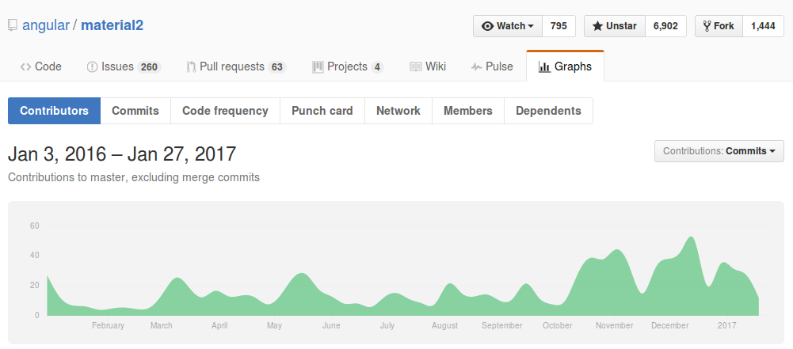

> Disclaimer : I am biased towards Materialize. Love to be corrected. 

#### Project status 
Materialize development is almost complete while angular material development just started . We can see the stats from the github pages. 

 
 
#### Code Approach
These two frameworks take the code in two different ways. The differences : 

Materialize | Angular Material
------------|------------------
Built using pure CSS +js  |  Built using angular 
Can be used with any framework | Can be used only in Angular
CSS based styling | Component based styling


#### CSS based styling vs Component based styling :

I am not aware of the exact terms. The difference is how the HTML looks after rendering . 
Lets take an example of simple checkbox. 


Materialize HTML Code ( Before and after rendering): 
```HTML
<input id="test9" type="checkbox">
<label for="test9">Red</label>
```

Angular Material HTML Code (before rendering):
```HTML
<md-checkbox>Check me!</md-checkbox>
```
Angular Material HTML Code (After Rendering): 
```HTML
<md-checkbox class="md-accent">
  <label class="md-checkbox-layout">
    <div class="md-checkbox-inner-container">
      <input class="md-checkbox-input cdk-visually-hidden" 
        id="input-md-checkbox-5" name="null" tabindex="0" aria-label="" 
          type="checkbox">
      <!--template bindings={}-->
      <div class="md-checkbox-ripple" md-ripple="" 
            mdripplebackgroundcolor="rgba(0, 0, 0, 0)">
        <div class="md-ripple-background"></div>
      </div>
      <div class="md-checkbox-frame"></div>
      <div class="md-checkbox-background">
        <svg xml:space="preserve" class="md-checkbox-checkmark" 
            version="1.1" viewBox="0 0 24 24" xmlns="http://www.w3.org/2000/svg">
          <path class="md-checkbox-checkmark-path" d="M4.1,12.7 9,17.6 20.3,6.3"
              fill="none" stroke="white"/>
        </svg>
        <div class="md-checkbox-mixedmark"></div>
      </div>
    </div>
    <span class="md-checkbox-label">Check me!</span>
  </label>
</md-checkbox>
```

Disadvantages with component approach: 
- More code obviously 
- More code , so lots of possibilities for bugs. 

For ex: 
In the above checkbox, the checked state is shown using a class 'checked' assigned to div. And manually input is made to be true. These two need to be in sync always. If an external mechanism tries to make input false, the visual checkbox would not be unchecked.

#### Components comparison

Angular Material is still in development( as of 27 Jan 2017). So, if a component is missing in angular material 2, we will see the component in material 1 to compare the features.

Component | Materialize | Angular material 2 | Angular Material 1
---|---|---
buttons | Yes | Yes | Yes 
Badges| Yes | No | 
Breadcrumbs|Yes | No | 
Cards|Yes | Yes |
Chips|Yes | No | 
Collections|Yes | Yes|
Footer|Yes | No |
Forms|Yes | Partial |
Icons|Yes | Yes |
Navbar|Yes | No | 
Pagination|Yes | No |
Preloader|Yes | Yes |
SideNav | Yes | Yes |
Carousel | Yes | No | 
Table | Yes | No | 
Collapsible | Yes | No | 
Dialogs| Yes | Yes | 
Parallax | Yes | No | 

More components to be added to the list . But for now , Angular Material is clearly lagging behind.

